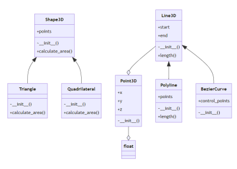

# PyMaid

## What is this?
PyMaid is a tool to automatically generate MermaidJS class diagrams from python3 source code. PyMaid uses the native `ast` module to parse a raw text stream of `.py` files and generate the proper syntax for MermaidJS [class diagrams](https://mermaid.js.org/syntax/classDiagram.html). 

*Please Note: PyMaid is a work in progress and is not yet ready for production use.* 

## Details
This tool was created to get a quick visual representation of `python3` codebases. We are open to contributions and feature requests. We aim to keep PyMaid simple and portable by having 0 external dependencies. 

## Setup & Installation
```bash
# ensure python3 is installed
> python3 --version
Python 3.8.3
# clone repo
> git clone <repo-url> pymaid_dir
> cd pymaid_dir
```

## Usage
```bash
# ~/pymaid_dir/
> python3 pymaid -h
usage: pymaid -i <input> [-o] <output>

PyMaid version 0.0.1

optional arguments:
  -h, --help      show this help message and exit
  -i , --input    Input file or glob
  -o , --output   Output file to write to
```
*Please Note: PyMaid is not yet packaged for pip installation. We intend to do this in the future.*

## Sample Usage

  
```bash
> python3 pymaid samples/shapes.py
> cat out.md
classDiagram
  Point3D --o float
  Shape3D <|-- Triangle
  Shape3D <|-- Quadrilateral
  Line3D --o Point3D
  Line3D <|-- Polyline
  Line3D <|-- BezierCurve
... 
```

## Limitations
PyMaid is still in development and has a few limitations:
- PyMaid works best when methods are type hinted.
- We cannot yet guarantee comprehensive styling of `UML` relationship arrows.
- Using the native `ast` module provides some robustness over a pattern-matching approach. However, more testing it needed to verify syntax coverage.

Read more about MermaidJS [here](https://mermaid.js.org/). It is an excellent tool.